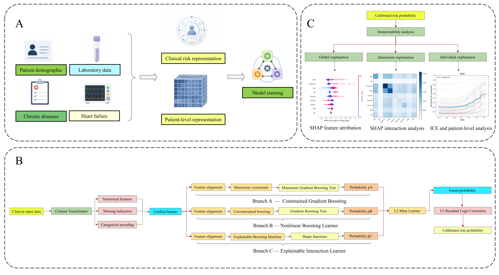

# CardioMonoStack

<p align="center">
  
</p>

<p align="center"><em>Figure 1. Overall CardioMonoStack framework.</em></p>

**CardioMonoStack** is a modular ensemble learning framework for heart-failure risk prediction after total hip arthroplasty (THA).  
The architecture integrates:

- **L1:** three heterogeneous base learners  
  - Branch A: monotonic LightGBM  
  - Branch B: CatBoost  
  - Branch C: Explainable Boosting Machine (EBM)
- **L2:** logistic stacking meta-learner
- **L3:** feature-dependent residual logit correction

This repository provides the **model framework code** for CardioMonoStack as described in the manuscript and supplementary material.

---

## Overview

CardioMonoStack was designed to combine:

- clinically constrained nonlinear learning,
- unconstrained nonlinear learning,
- interpretable additive modeling,
- stacked probability fusion, and
- patient-specific residual probability refinement.

The overall workflow is:

```text
Input features
    ↓
L1 base learners
    ├── Branch A: Monotonic LightGBM
    ├── Branch B: CatBoost
    └── Branch C: EBM
    ↓
L2 stacking
    └── Logistic regression meta-learner
    ↓
L3 correction
    └── Residual logit correction
    ↓
Final risk probability
```

---

## Repository structure

```text
CardioMonoStack/
│
├── setup.py
├── requirements.txt
├── README.md
│
├── cardiomonostack/
│   ├── __init__.py
│   ├── model.py
│   │
│   ├── branches/
│   │   ├── monotonic_branch.py
│   │   ├── boosting_branch.py
│   │   └── ebm_branch.py
│   │
│   ├── stacking/
│   │   └── meta_learner.py
│   │
│   ├── correction/
│   │   └── residual_logit.py
│   │
│   ├── preprocessing/
│   │   └── transformer.py
│   │
│   └── utils/
│       └── config.py
│
└── examples/
    └── predict_example.py
```

---

## Installation

Clone the repository:

```bash
git clone https://github.com/your-username/CardioMonoStack.git
cd CardioMonoStack
```

Install dependencies:

```bash
pip install -r requirements.txt
```

Or install as a package:

```bash
pip install .
```

---

## Quick start

```python
import pandas as pd
import numpy as np

from cardiomonostack import CardioMonoStack, CardioMonoTransformer

# Example input
X = pd.DataFrame({
    "age": [72, 80, 68],
    "sex": [1, 0, 1],
    "Creatinine": [1.1, 1.5, 0.9],
    "BUN": [22, 30, 15],
    "Sodium": [137, 135, 140],
    "Chloride": [102, 100, 104],
    "Glucose": [130, 160, 110],
    "HTN": [1, 1, 0],
    "DM": [0, 1, 0]
})

y = np.array([0, 1, 0])

transformer = CardioMonoTransformer()
X_ready = transformer.fit_transform(X)

model = CardioMonoStack()
model.fit(X_ready, y)

risk_probability = model.predict_proba(X_ready)
prediction = model.predict(X_ready)

print("Predicted probabilities:", risk_probability)
print("Binary prediction:", prediction)
```

---

## Input variables

The current model framework expects the following 9 predictors in this order:

1. `age` — years  
2. `sex` — 0 = Female, 1 = Male  
3. `Creatinine` — mg/dL  
4. `BUN` — mg/dL  
5. `Sodium` — mmol/L  
6. `Chloride` — mmol/L  
7. `Glucose` — mg/dL  
8. `HTN` — 0 = No, 1 = Yes  
9. `DM` — 0 = No, 1 = Yes  

---

## Model architecture details

### Branch A: Monotonic LightGBM
This branch applies prespecified monotonic constraints to clinically supported predictors.

Constrained features:
- `age` (+1)
- `Creatinine` (+1)
- `BUN` (+1)
- `Glucose` (+1)

### Branch B: CatBoost
This branch captures unconstrained nonlinear relationships using ordered boosting.

### Branch C: Explainable Boosting Machine
This branch models additive main effects and selected pairwise interactions.

### L2: Stacked meta-learning
The three branch probabilities are fused by a logistic regression meta-learner.

### L3: Residual logit correction
A gradient boosting regressor learns patient-specific residual refinement in logit space.

---


## Data availability

The original manuscript states that source data are available from the corresponding repositories, subject to access requirements and data-use agreements. This repository does not redistribute patient-level data.

---

## Citation

If you use this repository, please cite the associated manuscript:

**CardioMonoStack: A Postoperative Heart Failure Risk Prediction Model for Total Hip Arthroplasty Driven by Ensemble Learning**


---

## Disclaimer

This code is provided for research and reproducibility purposes only.  
It is a candidate modeling framework and is **not** a deployment-ready clinical decision tool.
